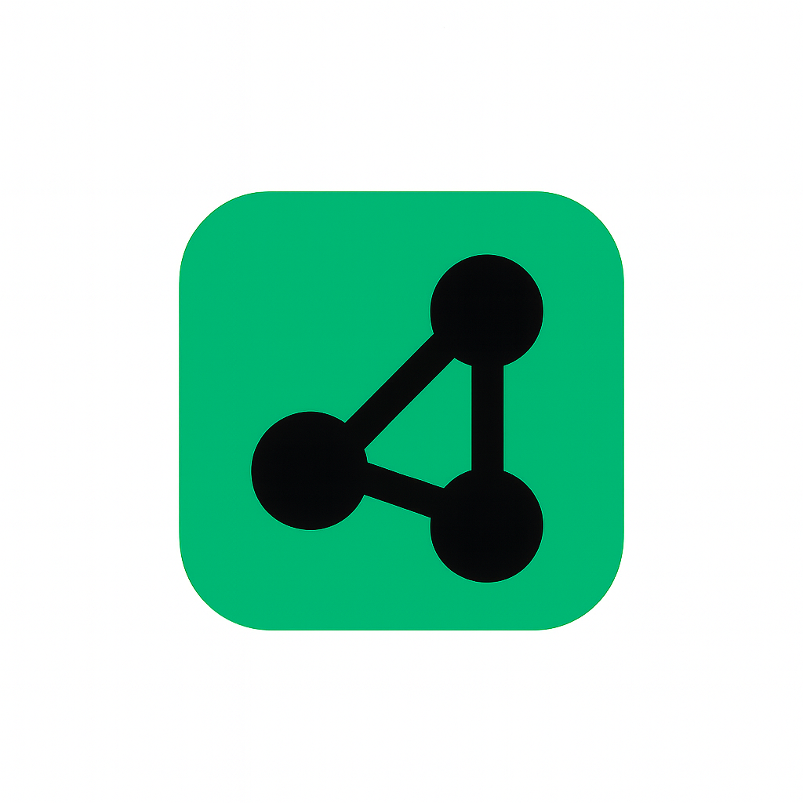

<h1 style="display: flex; align-items: center; gap: 12px;">
  
  
  miniTCP
</h1>


This project is a small experiment to understand how some TCP ideas can be recreated on top of UDP.
It doesn’t aim to be a real protocol—just a simple learning tool to see how things like handshakes, sequence numbers, ACKs, and basic reliability work behind the scenes.

There are two main files:

* **toy_tcp_receiver.py** – behaves like a server
* **toy_tcp_sender.py** – behaves like a client

Both sides talk using UDP sockets, and the logic we add on top is what makes it feel “TCP-like.”

---

## How It Works

**1. Handshake**
Before sending any data, the sender and receiver go through a short 3-step handshake (SYN → SYN-ACK → ACK).
This sets up the initial sequence numbers and tells both sides that the connection is ready.

**2. Data + Sequence Numbers**
Every packet carries a `seq` value saying “this data belongs here.”
The receiver keeps an `expected_seq` value so it knows which packet should come next.

**3. ACKs**
For each data packet, the receiver replies with an ACK number indicating how much data it has received so far.

**4. Retransmission**
If the sender does not receive an ACK within a timeout, it resends the same packet.

**5. Out-of-Order Handling**
UDP doesn’t guarantee order, so the receiver stores out-of-order packets in a small buffer and delivers them once the missing piece arrives.

---

## Running the Demo

Start the receiver:

```
python3 toy_tcp_receiver.py
```

Then start the sender in another terminal:

```
python3 toy_tcp_sender.py
```

You’ll see the handshake happen, data being sent, ACKs being printed, and the receiver delivering everything in the correct order.

---

## Why This Project Exists

Writing a tiny reliable protocol on top of UDP is a good way to understand the core concepts behind TCP.
This project keeps things small and readable so you can follow what’s happening step by step without getting lost in real TCP’s complexity.

---


